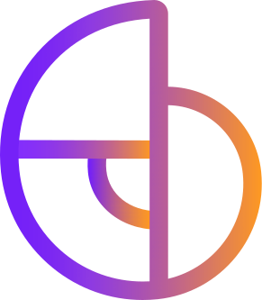

<!--
  ╔══════════════════════════════════════════════════════════════╗
  ║  README — Arthur Palhares                                    ║
  ║  Palette: forest #14241C · leaf #3E7C59 · sage #A8C3A0       ║
  ║           denim #7E9AB0 (inspired by the profile photo)      ║
  ║  Assets expected:                                            ║
  ║    assets/icone-none-default.svg  → GovHub logo              ║
  ║    assets/icone-unb-default.png   → UnB logo                 ║
  ║  TODO: replace the Gmail / LinkedIn placeholders below       ║
  ╚══════════════════════════════════════════════════════════════╝
-->

<h1 align="center">
  
</h1>

  <em>Software Engineering &nbsp;•&nbsp; Full-Stack &nbsp;•&nbsp; Data Engineering &nbsp;•&nbsp; Knowledge Management</em>

  

<h4 align="center">
  Technical Knowledge Manager @ <strong>GovHub</strong>
  
  &nbsp;&nbsp;|&nbsp;&nbsp;
  Software Engineering student @ <strong>UnB</strong>
  
    
</h4>

<!-- ─────────────────────────  SOCIALS  ───────────────────────── -->

  
  
  
  

  

 

<!-- ─────────────────────────  ABOUT  ───────────────────────── -->

### About Me

YAML


name: Arthur Palhares
role: Technical Knowledge Manager @ GovHub
studying: Software Engineering — University of Brasília (UnB)
focus:
  - Full-stack development, end to end
  - Relational data systems & data modeling
  - Containerization and reproducible environments
  - Engineering best practices, clean code & documentation
loves: turning messy knowledge into systems people can actually use

- Full-stack developer — comfortable from the database schema up to the last pixel of the UI.
- Relational data systems — modeling, querying and tuning PostgreSQL with care.
- Containerization — Docker-first workflows so "works on my machine" never happens again.
- Best practices — code review culture, testing, versioning, CI and documentation that survives the sprint.
- Data Engineer enthusiast — orchestration, transformation and analytics pipelines are a favorite rabbit hole.
- Building public-sector technology that people actually depend on.

 

  

<!-- ─────────────────────────  TECH STACK  ───────────────────────── -->

### Tech Stack

<table align="center">
  <tr>
    <td align="center">
      
    </td>
    <td align="center">
      
    </td>
    <td align="center">
      
    </td>
  </tr>

  <tr>
    <td align="center" width="33%">
      
      
      
      
      
      
    </td>
    <td align="center" width="33%">
      
      
      
      
      
      
      
      
    </td>
    <td align="center" width="33%">
      

      
      
      
      
      
    </td>
  </tr>
</table>

 

<!-- ─────────────────────────  PROJECTS  ───────────────────────── -->

### What I've Been Building

<strong>GovHub — Technical Knowledge Manager</strong>

 

Responsible for capturing, structuring and spreading the technical knowledge of a public-sector data platform: architecture decisions, onboarding trails, documentation standards and engineering guidelines that keep a multi-team project coherent as it grows.

Highlights

- Living documentation and knowledge base for data and application teams
- Architecture Decision Records, onboarding guides and internal standards
- Mentoring and review culture across squads

Tech Stack

PostgreSQL · Python · Docker · Airflow · dbt · Git

<strong>Full-Stack Applications</strong>

 

End-to-end product work: relational data modeling, REST APIs, authentication, and modern front-ends — shipped in containers, covered by tests, documented on the way.

Tech Stack

TypeScript · React · Django · PostgreSQL

<strong>Data Pipelines & Relational Systems</strong>

 

Designing schemas that make sense, orchestrating ingestion and transformation, and turning raw tables into analytics people can trust and query without fear.

Tech Stack

Python · Airflow · dbt · PostgreSQL

<strong>Containerization & Developer Experience</strong>

 

Reproducible environments, slim images, multi-service compose setups and CI pipelines — so any developer can clone, run one command and start contributing.

Tech Stack

Docker · Linux · Git · GitHub Actions

 

  

<!-- ─────────────────────────  STATS  ───────────────────────── -->

### GitHub in Numbers

  

  

    

  

<!-- ─────────────────────────  FOCUS  ───────────────────────── -->

### Current Focus
- Full-stack architecture for public-sector platforms
- Data modeling & pipeline orchestration
- Containerized, reproducible development workflows
- Knowledge management as an engineering discipline
- Quality, testing and clean code — always

 

> 💬 *"Good software is knowledge made executable — and good documentation is what keeps it alive."*

 

  

  

